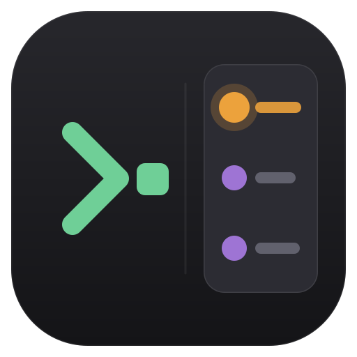

<p align="center">
  
</p>

<h1 align="center">GitPeek</h1>

<p align="center">
  A lightweight macOS menu-bar app that docks a live <b>git status panel</b> to the side of your iTerm2 window — so you never leave the terminal to see what changed.
</p>

<p align="center">
  
  
  
</p>

<p align="center">
  <a href="#english">English</a> · <a href="#中文">中文</a>
</p>

---

## English

GitPeek is a floating, always-in-sync git panel for people who live in the terminal. It follows your **iTerm2** window, reads the git repository of the front session, and shows the working-tree changes and commit graph — plus a VS Code–style single-file diff viewer — without opening a heavy editor.

### Features

- **Docks to iTerm2** — a borderless panel snaps to the left/right of your terminal window and follows it as you move or resize it. Hides when iTerm2 isn't frontmost.
- **CHANGES** — working-tree changes (staged + unstaged) with status letters (`M`/`A`/`D`/`U`/`R`), file name and dimmed path.
- **GRAPH** — commit history drawn as a real graph line. **Amber = local / not pushed**, **purple = pushed to remote**; local / `origin/*` / tag badges. Click a commit to expand the files it changed.
- **Single-file diff viewer** — click any file to open a second docked panel:
  - whole-file view (changes highlighted in place), soft-wrapped
  - **syntax highlighting** (comments / strings / numbers / keywords / types)
  - green = added, red = removed, with old/new line-number gutters
  - an **overview ruler / minimap** on the right with colored change markers and a draggable viewport thumb — click or drag it to jump
  - live-updates as you edit; scroll position is preserved
- **Resizable & persistent** — drag panel widths, drag the CHANGES ⇄ GRAPH split; dock left or right. Everything is remembered.
- **Quiet & fast** — a menu-bar agent (no Dock icon); refreshes via FSEvents + light polling, rate-limited, with the scroll position never jumping to the top.

### Requirements

- macOS 13 (Ventura) or later
- [iTerm2](https://iterm2.com/)
- `git` on your `PATH`
- Xcode / the Swift toolchain (to build)

### Build & install

```bash
git clone <your-repo-url> gitpeek
cd gitpeek

# (recommended) create a stable local signing identity so the Accessibility
# grant survives rebuilds — you may see one keychain prompt:
./setup-signing.sh

# build, bundle, sign, install to ~/Applications, and launch:
./build.sh
```

`build.sh` compiles a release build, assembles `GitPeek.app`, signs it, installs it to `~/Applications/GitPeek.app` and launches it. Re-run it any time to update.

### Permissions

On first launch GitPeek needs two macOS permissions:

1. **Accessibility** — to read the iTerm2 window's position so the panel can dock and follow it.
   System Settings → Privacy & Security → **Accessibility** → enable **GitPeek**.
2. **Automation** — to ask iTerm2 for the current session's directory. macOS shows a
   *"GitPeek wants to control iTerm2"* prompt the first time — click **OK**.

> Tip: run `./setup-signing.sh` before your first build so the app is signed with a stable identity. Otherwise every rebuild changes the code signature and you'll have to re-grant Accessibility.

### Usage

- Switch to iTerm2 and `cd` into a git repository — the panel appears and populates.
- Menu-bar icon (⎇): **Refresh**, **Dock side (left/right)**, Accessibility settings, Quit.
- **Drag the outer edge** of a panel to change its width.
- **Drag the bar between CHANGES and GRAPH** to change the split.
- **Click a commit** to expand its file list; **click a file** (in CHANGES or a commit) to open the diff.
- In the diff panel: the right strip is a combined **overview + scrollbar** — click/drag to navigate; the header has refresh and close.

### How it works

Pure Swift + SwiftUI, no third-party dependencies.

| Piece | Role |
|------|------|
| `WindowFollower` | reads iTerm2's focused-window frame via the Accessibility API and computes where the panel docks |
| `ITerm` | asks iTerm2 (AppleScript) for the front session's directory |
| `GitService` | resolves the repo and runs `git status` / `git log`; content-derived identities keep the list stable so scrolling never resets |
| `PanelCoordinator` | commit-expansion state + the diff document (never stored in git state) |
| `DiffBuilder` / `SyntaxHighlighter` | parse a unified diff and highlight it |
| `PanelView` / `DiffPanelView` | the SwiftUI UI |

### Known limitations

- Follows **windowed** iTerm2 (fullscreen following is not tuned).
- Diff view caps very large files (first few thousand lines) and shows merge / conflict diffs as a placeholder.
- Syntax highlighting is a lightweight, language-agnostic tokenizer — good enough to read, not a full grammar.

### License

[MIT](LICENSE)

---

## 中文

GitPeek 是给「泡在终端里」的人做的悬浮 git 面板。它吸附在 **iTerm2** 窗口旁边、跟着窗口移动，读取当前会话所在仓库，展示工作区改动和提交图，还带一个 VS Code 风格的单文件 diff 查看器——不用再开一个笨重的编辑器只为看 git。

### 功能

- **吸附 iTerm2** — 无边框面板贴在终端窗口左/右侧并跟随移动、缩放；iTerm2 不在前台时自动隐藏。
- **CHANGES** — 工作区改动（暂存 + 未暂存），带状态字母（`M`/`A`/`D`/`U`/`R`）、文件名和淡色路径。
- **GRAPH** — 提交历史画成真正的图线。**琥珀色 = 本地未推送**，**紫色 = 已推送到远端**；本地 / `origin/*` / tag 徽章。点提交可展开它改动的文件。
- **单文件 diff 查看器** — 点任意文件弹出第二个吸附面板：
  - 整文件视图（改动就地高亮）、软换行
  - **语法高亮**（注释 / 字符串 / 数字 / 关键字 / 类型）
  - 绿=新增、红=删除，带旧/新双列行号
  - 右侧 **概览条 / minimap**：彩色改动标记 + 可拖动的视口滑块，点击或拖动即跳转
  - 编辑文件时实时更新；滚动位置不重置
- **可调且记忆** — 拖动面板宽度、拖动 CHANGES ⇄ GRAPH 分隔条、左右切换吸附方向，全部记住。
- **安静又快** — 菜单栏 agent（无 Dock 图标）；FSEvents + 轻量轮询刷新、带限流，滚动位置永远不会跳回顶部。

### 环境要求

- macOS 13 (Ventura) 及以上
- [iTerm2](https://iterm2.com/)
- `PATH` 里有 `git`
- Xcode / Swift 工具链（用于构建）

### 构建与安装

```bash
git clone <你的仓库地址> gitpeek
cd gitpeek

# （推荐）先建一个固定的本地签名身份，让「辅助功能」授权不会因重建失效
# 过程可能会弹一次钥匙串确认：
./setup-signing.sh

# 构建、打包、签名、安装到 ~/Applications 并启动：
./build.sh
```

`build.sh` 会编译 release、组装 `GitPeek.app`、签名、安装到 `~/Applications/GitPeek.app` 并启动。以后随时重跑即可更新。

### 权限

首次启动需要两个 macOS 权限：

1. **辅助功能（Accessibility）** — 读取 iTerm2 窗口位置，面板才能吸附跟随。
   系统设置 → 隐私与安全性 → **辅助功能** → 勾选 **GitPeek**。
2. **自动化（Automation）** — 向 iTerm2 询问当前会话目录。首次会弹
   *「"GitPeek" 想要控制 "iTerm2"」*，点**允许**。

> 提示：首次构建前先跑 `./setup-signing.sh`，用固定签名身份，否则每次重建都会改变签名指纹、辅助功能需要重新授权。

### 使用

- 切到 iTerm2 并 `cd` 进一个 git 仓库——面板出现并加载。
- 菜单栏图标（⎇）：**刷新**、**吸附方向（左/右）**、辅助功能设置、退出。
- **拖面板外侧边缘**改宽度。
- **拖 CHANGES 和 GRAPH 之间的分隔条**改比例。
- **点提交**展开文件列表；**点文件**（在 CHANGES 或某个提交里）打开 diff。
- diff 面板右侧那条是**概览 + 滚动条二合一**——点/拖即导航；头部有刷新和关闭。

### 实现原理

纯 Swift + SwiftUI，无第三方依赖。

| 模块 | 职责 |
|------|------|
| `WindowFollower` | 用辅助功能 API 读 iTerm2 焦点窗口位置，算出面板吸附到哪 |
| `ITerm` | 用 AppleScript 问 iTerm2 当前会话目录 |
| `GitService` | 解析仓库并跑 `git status` / `git log`；内容派生的 identity 让列表稳定、滚动不重置 |
| `PanelCoordinator` | 提交展开状态 + diff 文档（都不进 git 状态） |
| `DiffBuilder` / `SyntaxHighlighter` | 解析统一 diff 并高亮 |
| `PanelView` / `DiffPanelView` | SwiftUI 界面 |

### 已知限制

- 跟随的是**窗口模式**的 iTerm2（全屏跟随未特别调优）。
- diff 对超大文件会截断（前几千行），合并 / 冲突 diff 显示为占位提示。
- 语法高亮是轻量、语言无关的分词器——够看，不是完整语法解析。

### 许可

[MIT](LICENSE)
